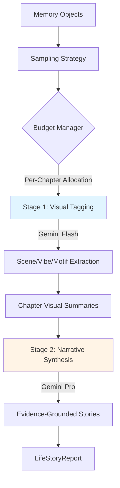

# Two-Stage Multimodal Architecture

## Overview

The Digital Life Narrative AI uses a sophisticated **two-stage multimodal pipeline** to transform raw media exports into deeply contextualized life stories. This architecture balances cost, accuracy, and narrative depth.

---

## Architecture Diagram



---

## Stage 1: Visual Intelligence (Low-Cost Tagging)

### Purpose

Extract structured visual context from sampled images using cost-efficient models.

### Model

- **Primary**: `gemini-2.0-flash-exp`
- **Fallback**: `gemini-1.5-flash`
- **Cost**: ~$0.0001 per image (512px, JPEG 80% quality)

### Process

#### 1. Intelligent Sampling

Located in: [`src/ai/sampling.py`](file:///c:/Users/georg/digital-life-narrative-ai/src/ai/sampling.py)

**Metadata-Aware Scoring**:

```python
score = 0.0
if memory.caption: score += 3.0
if memory.location: score += 2.0
score += len(memory.people) * 2.0  # Capped at 10
if "wedding" in path.lower(): score += 3.0  # Significance keywords
```

**Budget Management**:

- Global cap: `max_vision_images_per_run` (default: 250)
- Per-chapter allocation based on:
  - Duration: `weight = max(1, days / 30)`
  - Media density: `weight *= min(2.0, media_count / 100)`
- Ensures at least 1 image per chapter

**De-duplication**:

- Exact hash matching
- Timestamp + filesize heuristics
- Burst detection (3-second threshold)

#### 2. Visual Tagging

Located in: [`src/ai/visual_tagger.py`](file:///c:/Users/georg/digital-life-narrative-ai/src/ai/visual_tagger.py)

**API Optimization**:

- Resize to 512px (maintains aspect ratio)
- JPEG compression at 80% quality
- Base64 encoding for multimodal API

**Extraction Schema**:

```json
{
  "scene_tags": ["beach", "urban", "nature"],
  "vibe_tags": ["adventure", "reflective", "social"],
  "motifs": ["sunset", "architecture", "group_photo"],
  "description": "Brief visual summary",
  "confidence": 0.85
}
```

**Controlled Vocabulary**:

- Scenes: 25 predefined tags (indoor/outdoor, urban/nature, etc.)
- Vibes: 20 emotional/tonal tags (calm, energetic, nostalgic, etc.)
- Motifs: Open-ended (recurring visual elements)

#### 3. Chapter Aggregation

```python
# Statistical rollup per chapter
dominant_scenes = Counter(all_scene_tags).most_common(3)
dominant_vibes = Counter(all_vibe_tags).most_common(3)
recurring_motifs = Counter(all_motifs).most_common(8)
```

---

## Stage 2: Narrative Synthesis (Deep Understanding)

### Stage 2 Purpose

Generate coherent, evidence-grounded life stories using visual discoveries.

### Stage 2 Model

- **Primary**: `gemini-2.0-flash-exp` (fast, high-quality)
- **Alternative**: `gemini-1.5-pro` (legacy)
- **Cost**: ~$0.02 per 1,000 tokens

### Stage 2 Process

#### 1. Chapter Detection

Uses visual shifts to identify life phases:

- Timeline gap analysis
- Platform behavior changes
- **Visual vibe transitions** (NEW)

Example prompt injection:

```text
Visual Progression:
- Jan-Mar 2019: Vibes [urban, professional], Scenes [office, indoor]
- Apr-Jun 2019: Vibes [adventure, social], Scenes [beach, nature]
  → TRANSITION DETECTED
```

#### 2. Narrative Generation

Located in: [`src/ai/analyzer.py`](file:///c:/Users/georg/digital-life-narrative-ai/src/ai/analyzer.py#L508-L593)

**Visual Discovery Injection**:

```python
visual_discovery = format_visual_context_for_prompt(
    chapter,
    representative_descriptions=[m.caption for m in analyzed_memories][:5]
)

# Rendered as:
"""
Visual Discovery Evidence:
This chapter's visual signature: outdoor/nature scenes (60%), 
adventure/social vibes (75%). Recurring motifs: sunset, waterfront.

Representative moments:
- 2019-05-12: "Beach day with friends" (Scenes: beach, social)
- 2019-06-03: "Hiking trip" (Vibes: adventure, Scenes: nature)
"""
```

**Narrative Grounding**:
The AI is instructed to:

- Cite specific visual evidence
- Avoid generic platitudes
- Reference discovered scenes/vibes explicitly

#### 3. Executive Summary

Includes a **Visual Arc** analysis:

```python
visual_arc = format_timeline_visual_progression(chapters)
# Tracks how vibes/scenes evolved across the entire life story
```

---

## Depth Modes

Configured via [`src/config.py`](file:///c:/Users/georg/digital-life-narrative-ai/src/config.py)

### Quick Mode

- **Images**: 12-13 images per chapter (target: 12)
- **Use Case**: Rapid preview, cost-sensitive
- **Cost**: ~$0.50-$2.00

### Standard Mode (Default)

- **Images**: 13-16 images per chapter (target: 14)
- **Use Case**: Balanced narratives
- **Cost**: ~$2.00-$8.00

### Deep Mode

- **Images**: 16-23 images per chapter (target: 19)
- **Use Case**: Comprehensive analysis
- **Cost**: ~$8.00-$35.00

#### Cost Factors

Costs assume 1,000 photos, 5-10 chapters, Gemini Flash pricing

---

## Implementation Details

### Core Files

1. **[`src/ai/analyzer.py`](file:///c:/Users/georg/digital-life-narrative-ai/src/ai/analyzer.py)**
   - Main orchestrator
   - 5-phase flow: Analytics → Chapters → **Visual Enrichment** → Narratives → Summary
   - Line 231-234: Per-chapter visual analysis invocation

2. **[`src/ai/sampling.py`](file:///c:/Users/georg/digital-life-narrative-ai/src/ai/sampling.py)**
   - `SamplingStrategy`: Metadata scoring
   - `BudgetManager`: Global cap allocation
   - `plan_visual_sampling()`: Orchestration function

3. **[`src/ai/visual_tagger.py`](file:///c:/Users/georg/digital-life-narrative-ai/src/ai/visual_tagger.py)**
   - `VisualTagger`: Flash-based tagging
   - `tag_batch()`: Resilient batching (5 images/batch)
   - `aggregate_chapter_visuals()`: Statistical rollup

4. **[`src/ai/prompts.py`](file:///c:/Users/georg/digital-life-narrative-ai/src/ai/prompts.py)**
   - `VISUAL_TAGGING_PROMPT`: Stage 1 schema
   - `format_visual_context_for_prompt()`: Evidence formatter
   - `format_timeline_visual_progression()`: Visual arc generator

---

## Usage Examples

### Basic Usage (Default: Standard Depth)

```python
from src.ai import LifeStoryAnalyzer

analyzer = LifeStoryAnalyzer()
report = analyzer.analyze(memories)  # Automatically runs two-stage flow
```

### Explicit Depth Control

```python
from src.ai.life_analyzer import analyze_with_visual_depth

report = analyze_with_visual_depth(
    memories,
    depth="deep",
    max_images=300,
    vision_model="gemini-2.0-flash-exp"
)
```

### Cost Estimation (Pre-flight)

```python
from src.ai.life_analyzer import estimate_visual_cost

cost = estimate_visual_cost(memories, depth="deep")
print(f"Estimated cost: ${cost['total_estimated_cost_usd']:.2f}")
print(f"Images to analyze: {cost['estimated_images']}")

if cost['total_estimated_cost_usd'] < 10.0:
    report = analyze_with_visual_depth(memories, depth="deep")
```

### Privacy-First Mode (No Vision)

```python
from src.ai.life_analyzer import analyze_without_vision

report = analyze_without_vision(memories)
# Skips Stage 1 entirely, relies on metadata only
```

---

## Cost Control Mechanisms

### 1. Global Caps

```python
# In config.yaml or environment
ai:
  max_vision_images_per_run: 250
  warn_on_large_dataset_threshold: 5000
  force_cap_reduction_threshold: 10000
```

### 2. Dynamic Reduction

If dataset > 10,000 memories:

```python
if len(candidates) > ai_cfg.force_cap_reduction_threshold:
    target_count = min(target_count, 50 if depth == QUICK else 100)
```

### 3. Per-Run Override

```bash
organizer analyze -i photos/ -o report --max-images 50
```

---

## Performance Characteristics

### Typical Execution Times

- **Sampling**: 2-5 seconds (for 10,000 photos)
- **Stage 1 Tagging**: 30-60 seconds (100 images at ~500ms/image)
- **Stage 2 Narratives**: 60-120 seconds (depends on chapter count)
- **Total**: 2-5 minutes for standard depth

### Scaling Behavior

- Linear with sampled image count (Stage 1)
- Linear with chapter count (Stage 2)
- Sampling efficiency: O(n log n) for scoring + sorting

---

## Error Handling & Graceful Degradation

### Visual Analysis Failures

```python
try:
    visual_stats = self._enrich_visual_context(memories, chapters, config)
except Exception as e:
    logger.warning(f"Visual enrichment failed: {e}")
    visual_stats = VisualAnalysisStats(total_images_available=0)
    # Continue with metadata-only narratives
```

### Individual Image Failures

- Logged but non-blocking
- Skipped in aggregation
- Report indicates partial visual coverage

---

## Future Enhancements

1. **Video Analysis**: Extract keyframes + motion patterns
2. **Face Clustering**: Group people across photos for better "who" tracking
3. **Multi-Modal Caching**: Cache visual tags to avoid re-analysis
4. **Adaptive Sampling**: Use early visual discoveries to guide later sampling

---

## References

- [Implementation Plan](file:///c:/Users/georg/.gemini/antigravity/brain/aa4feec9-0a59-4df9-a922-c70a23fe7058/implementation_plan.md)
- [Multimodal Walkthrough](file:///c:/Users/georg/.gemini/antigravity/brain/aa4feec9-0a59-4df9-a922-c70a23fe7058/walkthrough_multimodal.md)
- [Architecture Overview](file:///c:/Users/georg/digital-life-narrative-ai/ARCHITECTURE.md)
